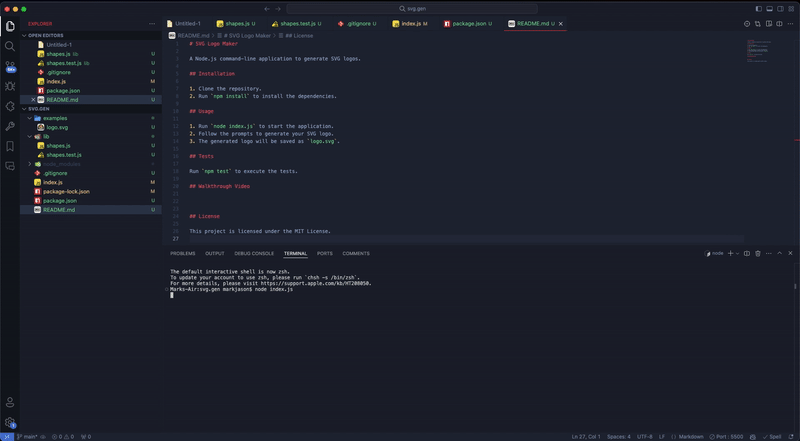
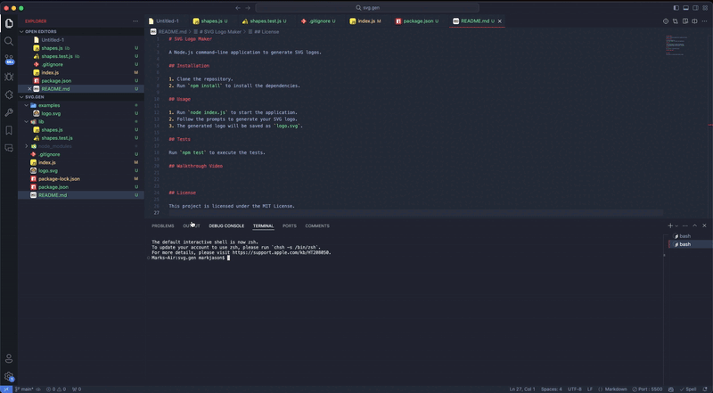

# SVG Logo Maker

A Node.js command-line application to generate SVG logos.

## Installation

1. Clone the repository.
2. Run `npm install` to install the dependencies.

## Usage

1. Run `node index.js` to start the application.
2. Follow the prompts to generate your SVG logo.
3. The generated logo will be saved as `logo.svg`.

## Tests

Run `npm test` to execute the tests.

## Walkthrough Video

 CLICK [[here]](https://youtu.be/2ebdN9RPO0o?si=tKdN7l8ZdDTANmhM)

## License

This project is licensed under the MIT License.
